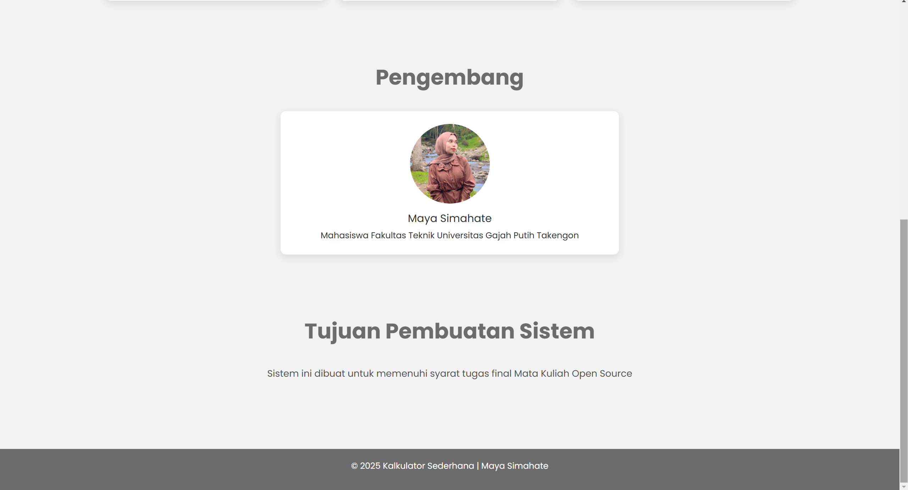
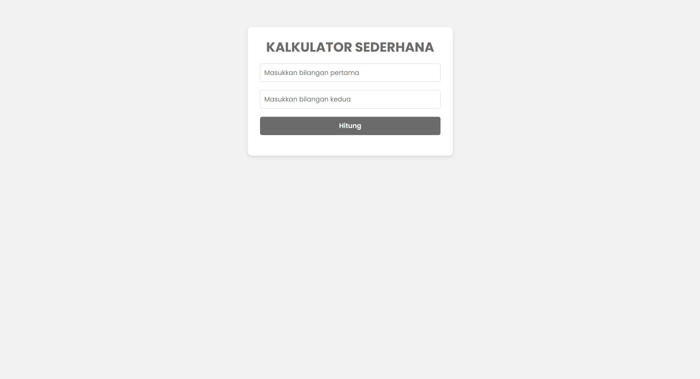
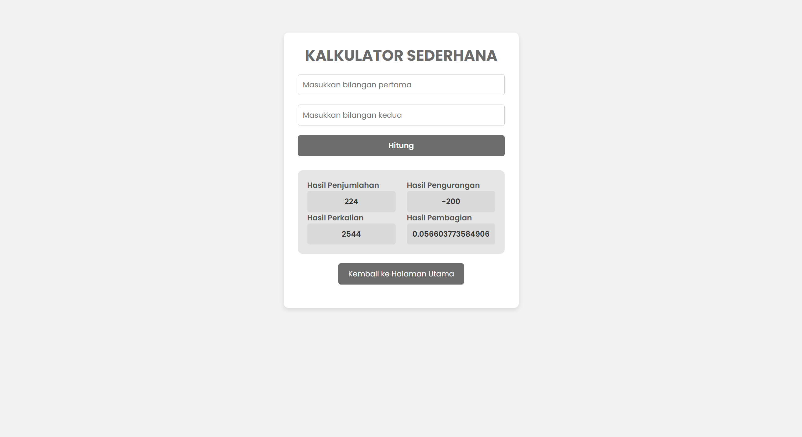

# Sistem Kalkulator Sederhana dengan PHP

Sistem Kalkulator Sederhana adalah aplikasi berbasis web yang dibuat menggunakan PHP untuk melakukan perhitungan aritmatika dasar seperti penjumlahan, pengurangan, perkalian, dan pembagian. Proyek ini cocok untuk pemula yang ingin belajar dasar-dasar pengembangan aplikasi web dengan PHP.

## Fitur
- Operasi dasar:
  - Penjumlahan (+)
  - Pengurangan (-)
  - Perkalian (*)
  - Pembagian (/)
- Antarmuka pengguna sederhana menggunakan HTML dan CSS.
- Validasi input untuk memastikan angka yang valid dimasukkan.
- Tidak memerlukan database atau framework tambahan.

## Demo Tampilan




## Persyaratan Sistem
- Server web (contoh: Apache atau Nginx).
- PHP versi 7.0 atau lebih baru.
- Browser modern untuk menjalankan aplikasi.

## Instalasi
1. **Clone repositori ini**:
   ```bash
   git clone https://github.com/mayasimahate/kalkulator-sederhana.git
